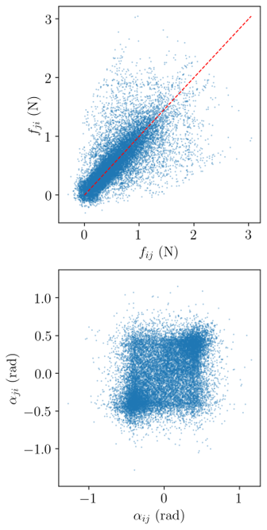
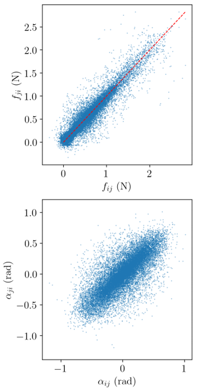
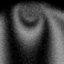
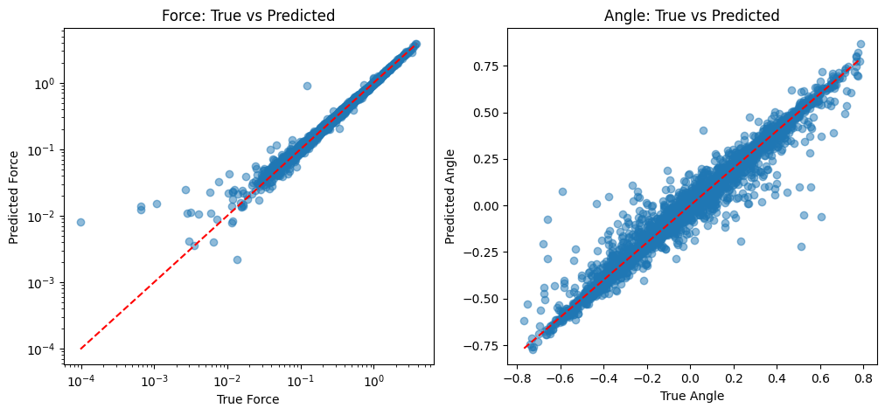

## About

Contact force measurement is a fundamental challenge in granular materials research. This project trains a ResNet18-based model to predict contact force magnitude and direction from images, outperforming the traditional G² approximation in wet conditions, leading to better results in the ensuing force inversion process.

<table><tr>
<td></td>
<td></td>
</tr></table>

*Scatter plot of Force magnitudes (top) and angles (bottom) of a contact force $F_{ij}$ vs its reciprocal $F_{ji}$. Left is the G² approximation, right is the CNN regression. The CNN results show a tighter clustering around the ideal $y=x$ line, indicating more accurate force predictions.*


## Method 

This aim is to predict contact force magnitude and angle from grayscale particle contact-region images like this one:

 

Since real labeled data is scarce, we generate synthetic training images using analytical solutions with known ground-truth forces, then transfer to real experimental images.

We first generated multiple synthetic images of photoelastic disks subject to randomly generated vector forces at random contact points. Note that the force vectors are assigned such that each disk is in equilibrium. We then crop out the contact regions from these synthetic images and use them as training data, with the known force magnitudes and angles as labels. The trained model can then be further optimized by using limited experimental image data with known forces (e.g. from a calibration rig) for fine-tuning, which is not shown here.

---

## Repository contents

| File / Folder | Description |
|---|---|
| `Contact_force_regression_label_produce.ipynb` | Crops per-contact images from synthetic simulations and builds the dataset (`labels.npy`) |
| `Contact_force_regression_TRAINING.ipynb` | Two-phase ResNet18 training: warmup (frozen backbone) then full fine-tuning |
| `sample_data/` | 500-image sample dataset for quick end-to-end testing. `labels.npy` contain the full 31500 labels used to train the model |

---

## Data format

To generat training data, one must first get a set of random forces and corresponding synthetic images subject to various physical constraints (i.e., force/torque balance, frictional limits, contact number limits). This is thoroughly discussed in the work by Sergazinov et al. (2024), and the generator code is available at: 
 https://github.com/mrsergazinov/particle-force-cnn


With the generated synthetic images and their known force labels, we can then run
`Contact_force_regression_label_produce.ipynb` 
to crop out the contact regions and build the dataset for training. Each contact in the original image corresponds to one cropped image and one label (force magnitude and angle).

It outputs:

```
<output_dir>/
    00001.png  ...  NNNNN.png   ← one crop per contact
    labels.npy                  ← shape (N_contacts, 2): [force_mag, force_angle]
```

---

## Model

- **Backbone:** ResNet18 (pretrained on ImageNet)
- **Head:** `Linear(512→256) → ReLU → Dropout(0.2) → Linear(256→2)`
- **Input:** 224 × 224, 3-channel (greyscale repeated), ImageNet-normalised
- **Output:** `[force_magnitude, force_angle]`
- **Loss:** `MSE(force) + MSE(angle)`

### Training phases

| Phase | Backbone | Optimizer | LR | Early stopping |
|---|---|---|---|---|
| Warmup | Frozen | Adam | 1 × 10⁻⁴ | patience = 20 |
| Fine-tuning | Unfrozen | Adam | 1 × 10⁻⁵ | patience = 20 |

Data is split **70 / 15 / 15** (train / val / test).

---

## Demo results

Predicted vs. true values on the held-out test set after training with 22050 images (70% of 31500) for training and 4725 images (15%) for validation. Results show reasonable agreement over two order of magnitudes in force magnitudes



---

## Requirements

```
pip install -r requirements.txt
```

| Package | Version |
|---|---|
| torch | 2.4.1 |
| torchvision | 0.19.1 |
| numpy | 1.23.5 |
| pandas | 1.4.1 |
| Pillow | 9.4.0 |
| matplotlib | 3.7.1 |
| opencv-python | 4.6.0.66 |
| tqdm | 4.65.0 |
